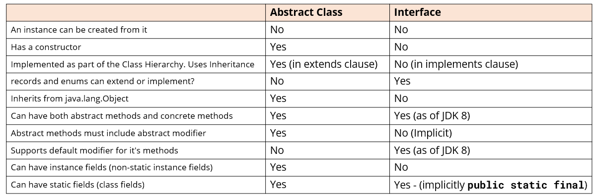

# Table of Contents

1. [Abstract Class](#Abstract-Class)

2. [Interface](#Interface)

3. [Interface vs Abstract Class](#Interface-vs-Abstract-Class)

## Abstract Class

- Abstract classes are very similar to interfaces. You can't instantiate either of them. Both types may contain a mix of methods declared with, or without a method block.
- With abstract classes, you can declare fields that aren't static and final, instance fields in other words.
- Also with abstract classes, you can use any of the four access modifiers for its concrete methods.
- You can also use all but the private access modifier, for its abstract methods.
- An abstract class can extend only one parent class, but it can implement multiple interfaces.
- When an abstract class is subclassed, the subclass usually provides implementations for all of the abstract methods in its parent class.
- However, if it doesn't, then the subclass must also be declared abstract.

**Use an Abstract class when...**

- You want to share code, among several closely related classes (Animal for example, with fields, name, age...).
- You expect classes that extend your abstract class, to have many common methods or fields, or require access modifiers other than public.
- You want to declare non-static or non-final fields (for example, name, age), so this enables you to define methods, that can access and modify the state of an object (getName, setName).
- You have a requirement for your base class, to provide a default implementation of certain methods, but other methods should be open to being overridden by child classes.
  `Summary: An abstract class provides a common definition, as a base class, that multiple, derived classes can share.`

## Interface

- An interface is just the declaration of methods, which you want some classes to have, it's not the implementation.

- In an interface, we define what kind of operation an object can perform. These operations are defined by the classes that implement the interface.

- Interfaces form a contract between the class, and the outside world, and this contract is enforced at build time, by the Java compiler.
- You can't instantiate interfaces, but they may contain a mix of methods declared with, or without an implementation.

- All methods on interfaces, declared without a method body, are automatically public and abstract.

- An interface can extend another interface.

- Interfaces are more flexible, and can deal with a lot more stress on the design of your program, because they aren't part of the class hierarchy.

- A best practice way of coding, is commonly called Coding to an Interface.

- By introducing interfaces into your program, you're really introducing points of variation, at which you can plug in different implementations for that interface.

`Summary: The interface decouples the "what", from the "how", and is used to make different types, behave in similar ways.`

- Since Java 8, interfaces can now contain default methods, so in other words methods with implementation. The keyword `default` is used mostly for backwards compatibility. Public static methods were also introduced in Java 8.

- Since Java 9, an interface can also contain private methods, commonly used when default methods share common code.

**Use an Interface when...**

- You expect that unrelated classes will implement your interface. For example, two of Java's own interfaces, Comparable and Cloneable, can be implemented by many unrelated classes.
- You want to specify the behavior of a particular data type, but you're not concerned about who implements its behavior.
- You want to separate different behavior.

## Interface vs Abstract Class

- I've said that interfaces and abstract classes are both abstracted types, and abstracted types are used as reference types in code.
- The table on this slide is a summary of the similarities and differences.

