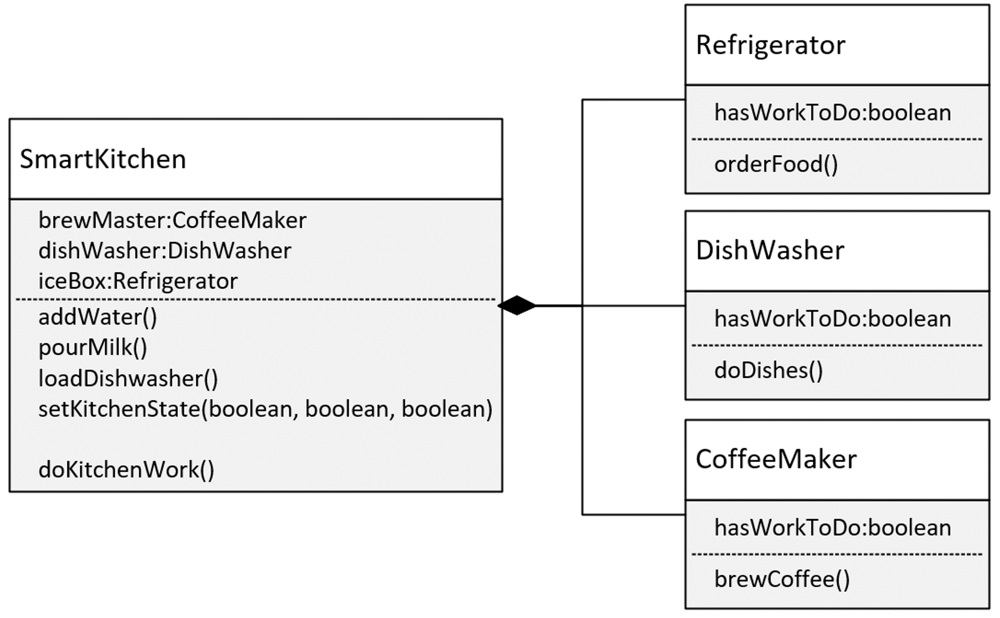

### STATIC AND INSTANCE METHOD

**Static Methods**

Static methods are declared using a static modifier. Static methods can't access instance methods and instant variables directly. They're usually used for operations that don't require any data from an instance of the class (from 'this'). If you remember, the this keyword is the current instance of a class.

So inside a static method, we can't use the this keyword. Whenever you see a method that doesn't use instance variables, that method should probably be declared as a static method. For example, main is a static method, and it's called by the Java virtual machine when it starts the Java application.

<p align="center">

</p>

**Instance Methods**

Instance methods belong to an instance, of a class. To use an instance method, we have to instantiate the class first, usually by using the new keyword.

Instance methods can access instance methods and instance variables directly.

Instance methods can also access static methods and static variables directly.

**Example for Instance Methods**

```java
class Dog{
    public void bark(){
        System.out.println("woof");
    }
}

public class Main{
    public static void main(String[] args) {
        Dog rex = new Dog();        // create instance
        rex.bark();                 // call instance method
    }
}
```

<br>

**When to use static or instance method in java**

<p align="center">

</p>

### Different POJO and The Record

**Plain Old Java Object**
A plain old Java object (whose acronym is POJO) is a class that generally only has instance fields.

It's used to house data, and pass data, between functional classes.

It usually has few, if any methods other than getters and setters. Many database frameworks use POJO's to read data from, or to write data to, databases, files or streams

<details>
<summary><strong> Example for POJO</strong></summary>

```java
public class PersonPOJO {
    private String name;
    private int age;

    public PersonPOJO(String name, int age) {
        this.name = name;
        this.age = age;
    }

    public String getName() {
        return name;
    }

    public void setName(String name) {
        this.name = name;
    }

    public int getAge() {
        return age;
    }

    public void setAge(int age) {
        this.age = age;
    }

    @Override
    public String toString() {
        return "PersonPOJO{" +
                "name='" + name + '\'' +
                ", age=" + age +
                '}';
    }

    public static void main(String[] args) {
        PersonPOJO person = new PersonPOJO("John", 30);
        System.out.println(person);
    }
}
```

</details>
<br>

**The Record**
The record is a special class that contains data, that's not meant to be altered.

In other words, it seeks to achieve immutability, for the data in its members.

It contains only the most fundamental methods, such as constructors and accessors.

Best of all, you the developer, don't have to write or generate any of this code.

<details>
<summary><strong> Example for The Record</strong></summary>

```java
public record PersonRecord(String name, int age) {
    public static void main(String[] args) {
        PersonRecord person = new PersonRecord("Jane", 25);
        System.out.println(person);
    }
}
```

</details>

## Inheritance

Inheritance is the mechanism by which an object acquires the some/all properties of another object.

The idea behind inheritance in Java is that you can create new classes that are built upon existing classes. When you inherit from an existing class, you can reuse methods and fields of the parent class. Moreover, you can add new methods and fields in your current class also.

In Oriented Object Programming, the computer programs are designed in such a way where everything is an object that interacts with one another object. It basically, helps in reusing the code and establish a relationship between different classes.

**Why use inheritance in java**

- For Method Overriding (so runtime polymorphism can be achieved).
- For Code Reusability.

## Type of Inheritance

<p align="center">

</p>

Based upon superclasses and subclasses, there are the following five types of inheritance in general:

1. [Single](#single)
2. [Multi-level](#multi)
3. [Hierarchical](#hierarchical)
4. [Multiple](#multiple)
5. [Hybrid](#hybrid)

### Single Inheritance <a name="single"></a>

In single inheritance, there is only a single class extending from another class. We can take the example of the `Vehicle` class (Super class) and the `Car` class (Sub class). Let’s implement these classes below:

<p align="center">

</p>

**Example for Single Inheritance**

```java
class Vehicle {          //Base Vehicle class

  private int topSpeed;
  public void setTopSpeed(int speed) {
    this.topSpeed=speed;
    System.out.println("The top speed is set to: "+ topSpeed);
  }

}

class Car extends Vehicle { // sub class Car extending from Vehicle

  public void openTrunk() {
    System.out.println("The Car trunk is Open Now");
  }

}

class Main {

  public static void main(String[] args) {
    Car corolla = new Car();
    corolla.setTopSpeed(220);
    corolla.openTrunk();
  }

}
```

### Multiple Inheritance <a name="multi"></a>

When a class is derived from such a class which itself is derived from another class, this type of inheritance is called Multilevel Inheritance. Classes can be extended to any further levels as per the requirement of the model.

Let’s implement the three classes illustrated above:

- A `Car` IS A `Vehicle`.
- A `Prius` IS A `Car`.

<p align="center">

</p>

**Example for Multi-level Inheritance**

```java
class Vehicle {          //Base Vehicle class

  private int topSpeed;

  public void setTopSpeed(int speed) {
    this.topSpeed=speed;
    System.out.println("The top speed is set to: "+ topSpeed);
  }

}

class Car extends Vehicle { // Derived from Vehicle Base for Prius

  public void openTrunk() {
    System.out.println("The Car trunk is Open Now!");
  }

}

class Prius extends Car {// Derived from Prius & can be base to any further class

  public void turnOnHybrid() {
    System.out.println("The Hybrid mode is turned on!");
  }

}

class Main {

  public static void main(String[] args) {
    Prius priusPrime = new Prius();
    priusPrime.setTopSpeed(220);
    priusPrime.openTrunk();
    priusPrime.turnOnHybrid();
  }

}
```

### Hierarchical Inheritance <a name="hierarchical"></a>

When more than one classes inherit from the same class, it is referred to as hierarchical inheritance. In hierarchical inheritance, more than one classes extend, as per the requirement of the design, from the same base class. The common attributes of these child classes are implemented inside the base class.

- A `Car` IS A `Vehicle`.
- A `Truck` IS A `Vehicle`.

<p align="center">

</p>

**Example for Hierarchical Inheritance**

```java
class Vehicle {          //Base Vehicle class

  private int topSpeed;

  public void setTopSpeed(int speed) {
    this.topSpeed=speed;
    System.out.println("The top speed of "+getClass().getSimpleName()+" is set to: "+ topSpeed);
  }

}

class Car extends Vehicle { // Derived from Vehicle Base for Prius

  //implementation of Car class
}

class Truck extends Vehicle {// Derived from Prius can be base to any further class

  //implementation of Truck class
}

class Main {

  public static void main(String[] args) {
    Car corolla = new Car();
    corolla.setTopSpeed(220);

    Truck volvo = new Truck();
    volvo.setTopSpeed(120);
  }

}
```

### Multiple Inheritance <a name="multiple"></a>

When a class is derived from more than one base class, i.e. when a class has more than one immediate parent classes, this type of inheritance is called Multiple Inheritance.

- A Hyundai `Elantra` IS A `Car`.
- A Hyundai `Elantra` IS A `Sedan` also.

<p align="center">

</p>

**Example for Multiple Inheritance**

```java
class A{
    oid msg(){
        System.out.println("Hello");
    }
}
class B{
    void msg(){
        System.out.println("Welcome");
    }
}
class C extends A,B{

 public static void main(String args[]){
   C obj=new C();
   obj.msg();//Now which msg() method would be invoked?
}
}

// RESULT
compile time error
```

### Hybrid Inheritance <a name="hybrid"></a>

A type of inheritance which is a combination of `Multiple` and `Multi-level` inheritance is called hybrid inheritance.

A combustion engine is an `engine`
An electric motors engine is an `engine`
A `Hybrid` engine combines both combustion engine and electric motors.

<p align="center">

</p>

**Example for Hybrid Inheritance**

```Java
//parent class
class GrandFather
{
    public void showG()
    {
        System.out.println("He is grandfather.");
    }
}
//inherits GrandFather properties
class Father extends GrandFather
{
    public void showF()
    {
        System.out.println("He is father.");
    }
}
//inherits Father properties
class Son extends Father
{
    public void showS()
    {
        System.out.println("He is son.");
    }
}
//inherits Father properties
public class Daughter extends Father
{
    public void showD()
    {
        System.out.println("She is daughter.");
    }
    public static void main(String args[])
    {
//Daughter obj = new Daughter();
//obj.show();
        Son obj = new Son();
        obj.showS();  // Accessing Son class method
        obj.showF();  // Accessing Father class method
        obj.showG();  // Accessing GrandFather class method
        Daughter obj2 = new Daughter();
        obj2.showD();  // Accessing Daughter class method
        obj2.showF();    // Accessing Father class method
        obj2.showG();   // Accessing GrandFather class method
    }
}

// RESULT

    He is son.
    He is father.
    He is grandfather.
    She is daughter.
    He is father.
    He is grandfather.
```

**Note:** `In Java, Multiple and Hybrid inheritance are applicable using interfaces only.`

**Advantages of inheritance**

| Advantages        | Description                                                                                                                                                                                |
| ----------------- | ------------------------------------------------------------------------------------------------------------------------------------------------------------------------------------------ |
| Reusability       | We don’t need to duplicate methods inside the child classes that also occur in the parent classes.                                                                                         |
| Code modification | Ensures that all changes are localized and inconsistencies are avoided.                                                                                                                    |
| Extensibility     | We can extend the base class as per the requirements of the derived class. It provides an easy way to upgrade or enhance specific parts of a product without changing the core attributes. |
| Data hiding       | A base class can keep some data private so that the derived class cannot alter it. This concept is called encapsulation.                                                                   |

<!-- ## Aggregation

If a class have an entity reference, it is known as Aggregation

<p align="center">

</p>

Create a main method that will create either a SalariedEmployee or HourlyEmployee, and call the methods, getAge, collectPay, and the method shown for the specific type of class you decide to implement.

**Example for Aggregation**

```java
public class Worker {

    private String name;
    private String birthDate;
    protected String endDate;

    public Worker() {

    }

    public Worker(String name, String birthDate) {
        this.name = name;
        this.birthDate = birthDate;
    }

    public int getAge() {

        int currentYear = 2025;
        int birthYear = Integer.parseInt(birthDate.substring(6));

        return (currentYear - birthYear);
    }

    public double collectPay() {
        return 0.0;
    }

    public void terminate(String endDate) {
        this.endDate = endDate;
    }

    @Override
    public String toString() {
        return "Worker{" +
                "name='" + name + '\'' +
                ", birthDate='" + birthDate + '\'' +
                ", endDate='" + endDate + '\'' +
                '}';
    }
}

```

```java
public class Employee extends Worker {

    private long employeeId;
    private String hireDate;

    private static int employeeNo = 1;

    public Employee(String name, String birthDate, String hireDate) {
        super(name, birthDate);
        this.employeeId = Employee.employeeNo++;
        this.hireDate = hireDate;
    }

    @Override
    public String toString() {
        return "Employee{" +
                "employeeId=" + employeeId +
                ", hireDate='" + hireDate + '\'' +
                "} " + super.toString();
    }
}

```

```java
public class SalariedEmployee extends Employee {

    double annualSalary;
    boolean isRetired;

    public SalariedEmployee(String name, String birthDate, String hireDate,
                            double annualSalary) {
        super(name, birthDate, hireDate);
        this.annualSalary = annualSalary;
    }

    @Override
    public double collectPay() {

        double paycheck = annualSalary / 26;
        double adjustedPay = (isRetired) ? 0.9 * paycheck : paycheck;

        return (int) adjustedPay;
    }

    public void retire() {

        terminate("12/12/2025");
        isRetired = true;
    }
}

```

```java
public class HourlyEmployee extends Employee {

    private double hourlyPayRate;

    public HourlyEmployee(String name, String birthDate, String hireDate,
                          double hourlyPayRate) {
        super(name, birthDate, hireDate);
        this.hourlyPayRate = hourlyPayRate;
    }

    @Override
    public double collectPay() {
        return 40 * hourlyPayRate;
    }

    public double getDoublePay() {
        return 2 * collectPay();
    }
}

```

```java
public class Main {

    public static void main(String[] args) {

        Employee tim = new Employee("Tim", "11/11/1985",
                "01/01/2020");
        System.out.println(tim);
        System.out.println("Age = " + tim.getAge());
        System.out.println("Pay = " + tim.collectPay());

        SalariedEmployee joe = new SalariedEmployee("Joe", "11/11/1990",
                "03/03/2020", 35000);
        System.out.println(joe);
        System.out.println("Joe's Paycheck = $" + joe.collectPay());

        joe.retire();
        System.out.println("Joe's Pension check = $" + joe.collectPay());

        HourlyEmployee mary = new HourlyEmployee("Mary", "05/05/1970",
                "03/03/2021", 15);
        System.out.println(mary);
        System.out.println("Mary's Paycheck = $" + mary.collectPay());
        System.out.println("Mary's Holiday Pay = $" + mary.getDoublePay());
    }
}

``` -->

## Composition

<p align="center">

</p>

`Composition` is another component of object-oriented programming. `Composition` is a way to make the combination of classes, act like a single coherent object.

**The reasons composition is preferred over inheritance:**

- Composition is more flexible. You can add parts in, or remove them, and these changes are less likely to have a downstream effect.
- Composition provides functional reuse outside of the class hierarchy, meaning classes can share attributes & behavior, by having similar components, instead of inheriting functionality from a parent or base class.
- Java's inheritance breaks encapsulation, because subclasses may need direct access to a parent's state or behavior.

**Why is Inheritance less flexible?**

- Inheritance is less flexible.
- Adding a class to, or removing a class from, a class hierarchy, may impact all subclasses from that point.
- In addition, a new subclass may not need all the functionality or attributes of its parent class.

**Example for composition**

```java

public class SmartKitchen {

    private CoffeeMaker brewMaster;
    private Refrigerator iceBox;
    private DishWasher dishWasher;

    public SmartKitchen() {
        brewMaster = new CoffeeMaker();
        iceBox = new Refrigerator();
        dishWasher = new DishWasher();
    }

    public CoffeeMaker getBrewMaster() {
        return brewMaster;
    }

    public Refrigerator getIceBox() {
        return iceBox;
    }

    public DishWasher getDishWasher() {
        return dishWasher;
    }

    public void setKitchenState(boolean coffeeFlag, boolean fridgeFlag,
                                boolean dishWasherFlag) {

        brewMaster.setHasWorkToDo(coffeeFlag);
        iceBox.setHasWorkToDo(fridgeFlag);
        dishWasher.setHasWorkToDo(dishWasherFlag);
    }

    public void doKitchenWork() {
        brewMaster.brewCoffee();
        iceBox.orderFood();
        dishWasher.doDishes();
    }
}

class CoffeeMaker {

    private boolean hasWorkToDo;

    public void setHasWorkToDo(boolean hasWorkToDo) {
        this.hasWorkToDo = hasWorkToDo;
    }

    public void brewCoffee() {

        if (hasWorkToDo) {
            System.out.println("Brewing Coffee");
            hasWorkToDo = false;
        }
    }
}


class Refrigerator {

    private boolean hasWorkToDo;

    public void setHasWorkToDo(boolean hasWorkToDo) {
        this.hasWorkToDo = hasWorkToDo;
    }

    public void orderFood() {

        if (hasWorkToDo) {
            System.out.println("Ordering Food");
            hasWorkToDo = false;
        }
    }
}

class DishWasher {

    private boolean hasWorkToDo;

    public void setHasWorkToDo(boolean hasWorkToDo) {
        this.hasWorkToDo = hasWorkToDo;
    }

    public void doDishes() {

        if (hasWorkToDo) {
            System.out.println("Washing Dishes");
            hasWorkToDo = false;
        }
    }
}
```
