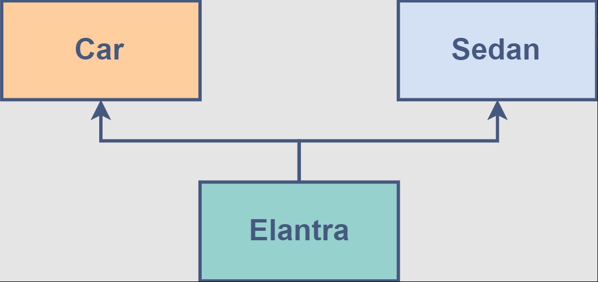

# Table of Contents

1. [Class and Object](#Object-And-Class)
   - [Constructor](#Constructor)
   - [Static and Instance Method](#Static-and-instance-method)
   - [POJO and The Record](#Different-POJO-and-The-Record)
2. [Inheritance](#inheritance)
   - [Single Inheritance](#single-inheritance)
   - [Multiple Inheritance](#multiple-inheritance)
   - [Multilevel Inheritance](#multilevel-inheritance)
   - [Hierarchical Inheritance](#hierarchical-inheritance)
   - [Hybrid Inheritance](#hybrid-inheritance)
3. [Aggregation](#aggregation)
4. [Other](#Other)
   - [This and super](#This-vs-super)
   - [Method Overriding and super](#This-vs-super)

## Object and Classes

Exist two main concepts in OOP: Object and Classes.

#### Object:

- Instances of clases
- Instances of clases

An instance is created so you can use the methods that that class defines.

It is a basic unit of Object Oriented Programming and represents the real life entities. A typical Java program creates many objects, which as you know, interact by invoking methods. An object consists of:

    State : It is represented by attributes of an object. It also reflects the properties of an object.

    Behavior : It is represented by methods of an object. It also reflects the response of an object with other objects.

    Identity : It gives a unique name to an object and enables one object to interact with other objects.

#### Class

Is a template that allow to create object, containt the definition of attributes and the procedure for the class

- They are used to represent entities or concepts
- Each object created from a class is called an instance of the class
- Has methods (Performs a task)
- It has attributes, by convention they must be private
- The name must begin with a capital letter

<strong>Static class:</strong>

- No need to create instances to call them
- Only static methods can be called

A class is a user defined blueprint or prototype from which objects are created. It represents the set of properties or methods that are common to all objects of one type. In general, class declarations can include these components, in order:

      Modifiers : A class can be public or has default access.

      Class name: The name should begin with a initial letter (capitalized by convention).

      Superclass(if any): The name of the class’s parent (superclass), if any, preceded by the keyword extends. A class can only extend (subclass) one parent.

      Interfaces(if any): A comma-separated list of interfaces implemented by the class, if any, preceded by the keyword implements. A class can implement more than one interface.

      Body: The class body surrounded by braces, { }.

### CONSTRUCTOR

A constructor is used in the creation of an object, that's an instance of a class.

It is a special type of code block that has a specific name and parameters, much like a method.

It has the same name as the class itself, and it doesn't return any values.

You never include a return type from a constructor, not even void.

You can, and should, specify an appropriate access modifier, to control who should be able to create new instances of the class.

```java
public class Account { // This is the class declaration
    public Account(){ // This is the constructor declaration
        // Constructor code is code to be executed as the object is created.
    }
}
```

**THE DEFAULT CONSTRUCTOR**

If a class contains no constructor declarations, then a default constructor is implicitly declared.

This constructor has no parameters, and is often called the no-args (no arguments) constructor.

If a class contains any other constructor declarations, then a default constructor is NOT implicitly declared.

<details>
<summary><strong>Example for Constructor</strong></summary>

```java
public class Customer {

    private String name;
    private double creditLimit;
    private String email;

    public Customer() {
        this("Nobody", "nobody@nowhere.com");
    }

    public Customer(String name, String email) {
        this(name, 1000, email);
    }

    public Customer(String name, double creditLimit, String email) {
        this.name = name;
        this.creditLimit = creditLimit;
        this.email = email;
    }

    public class Main {

    public static void main(String[] args) {

        Customer customer = new Customer("Tim", 1000,
                "tim@email.com");
        System.out.println(customer.getName());
        System.out.println(customer.getCreditLimit());
        System.out.println(customer.getEmail());

        Customer secondCustomer = new Customer();
        System.out.println(secondCustomer.getName());
        System.out.println(secondCustomer.getCreditLimit());
        System.out.println(secondCustomer.getEmail());

        Customer thirdCustomer = new Customer("Joe", "joe@email.com");
        System.out.println(thirdCustomer.getName());
        System.out.println(thirdCustomer.getCreditLimit());
        System.out.println(thirdCustomer.getEmail());
    }
}

```

</details>

### STATIC AND INSTANCE METHOD

**Static Methods**

Static methods are declared using a static modifier. Static methods can't access instance methods and instant variables directly. They're usually used for operations that don't require any data from an instance of the class (from 'this'). If you remember, the this keyword is the current instance of a class.

So inside a static method, we can't use the this keyword. Whenever you see a method that doesn't use instance variables, that method should probably be declared as a static method. For example, main is a static method, and it's called by the Java virtual machine when it starts the Java application.

<details>
<summary><strong> Example for Static Methods</strong></summary>
<p align="center">

</p>

</details>
<br>

**Instance Methods**

Instance methods belong to an instance, of a class. To use an instance method, we have to instantiate the class first, usually by using the new keyword.

Instance methods can access instance methods and instance variables directly.

Instance methods can also access static methods and static variables directly.

<details>
<summary><strong> Example for Instance Methods</strong></summary>

```java
class Dog{
    public void bark(){
        System.out.println("woof");
    }
}

public class Main{
    public static void main(String[] args) {
        Dog rex = new Dog();        // create instance
        rex.bark();                 // call instance method
    }
}
```

</details>
<br>

**When to use static or instance method in java**

<p align="center">

</p>

### Different POJO and The Record

**Plain Old Java Object**
A plain old Java object (whose acronym is POJO) is a class that generally only has instance fields.

It's used to house data, and pass data, between functional classes.

It usually has few, if any methods other than getters and setters. Many database frameworks use POJO's to read data from, or to write data to, databases, files or streams

<details>
<summary><strong> Example for POJO</strong></summary>

```java
public class PersonPOJO {
    private String name;
    private int age;

    public PersonPOJO(String name, int age) {
        this.name = name;
        this.age = age;
    }

    public String getName() {
        return name;
    }

    public void setName(String name) {
        this.name = name;
    }

    public int getAge() {
        return age;
    }

    public void setAge(int age) {
        this.age = age;
    }

    @Override
    public String toString() {
        return "PersonPOJO{" +
                "name='" + name + '\'' +
                ", age=" + age +
                '}';
    }

    public static void main(String[] args) {
        PersonPOJO person = new PersonPOJO("John", 30);
        System.out.println(person);
    }
}
```

</details>
<br>

**The Record**
The record is a special class that contains data, that's not meant to be altered.

In other words, it seeks to achieve immutability, for the data in its members.

It contains only the most fundamental methods, such as constructors and accessors.

Best of all, you the developer, don't have to write or generate any of this code.

<details>
<summary><strong> Example for The Record</strong></summary>

```java
public record PersonRecord(String name, int age) {
    public static void main(String[] args) {
        PersonRecord person = new PersonRecord("Jane", 25);
        System.out.println(person);
    }
}
```

</details>

## Inheritance

Inheritance is the mechanism by which an object acquires the some/all properties of another object.

The idea behind inheritance in Java is that you can create new classes that are built upon existing classes. When you inherit from an existing class, you can reuse methods and fields of the parent class. Moreover, you can add new methods and fields in your current class also.

In Oriented Object Programming, the computer programs are designed in such a way where everything is an object that interacts with one another object. It basically, helps in reusing the code and establish a relationship between different classes.

**Why use inheritance in java**

- For Method Overriding (so runtime polymorphism can be achieved).
- For Code Reusability.

## Type of Inheritance

<p align="center">

</p>

### Single Inheritance

In single inheritance, one class inherits the properties of another. It enables a derived class to inherit the properties and behavior from a single parent class. This will, in turn, enable code reusability as well as add new features to the existing code.

When a class inherits another class, it is known as a single inheritance. In the example given below, Dog class inherits the Animal class, so there is the single inheritance.

<p align="center">

</p>

Here, Class A is your parent class and Class B is your child class which inherits the properties and behavior of the parent class

<details>
<summary><strong>Example for Single Inheritance</strong></summary>

```java
class Animal{
    void eat(){
        System.out.println("eating...");
    }
}

class Dog extends Animal{
    void bark(){
        System.out.println("barking...");
    }
}

class TestInheritance{
    public static void main(String args[]){
        Dog d=new Dog();
        d.bark();
        d.eat();
    }
}

// RESULT
barking...
eating..
```

</details>

### Multiple Inheritance

To reduce the complexity and simplify the language, multiple inheritance is not supported in java.

<p align="center">

</p>

<details>
<summary><strong>Example for Multiple Inheritance</strong></summary>

```java
class A{
    oid msg(){
        System.out.println("Hello");
    }
}
class B{
    void msg(){
        System.out.println("Welcome");
    }
}
class C extends A,B{

 public static void main(String args[]){
   C obj=new C();
   obj.msg();//Now which msg() method would be invoked?
}
}

// RESULT
compile time error
```

</details>

### Multilevel Inheritance

When a class is derived from a class which is also derived from another class, i.e. a class having more than one parent class but at different levels, such type of inheritance is called Multilevel Inheritance.

When there is a chain of inheritance, it is known as multilevel inheritance. As you can see in the example given below, BabyDog class inherits the Dog class which again inherits the Animal class, so there is a multilevel inheritance.

<p align="center">

</p>

If we talk about the flowchart, class B inherits the properties and behavior of class A and class C inherits the properties of class B. Here A is the parent class for B and class B is the parent class for C. So in this case class C implicitly inherits the properties and methods of class A along with Class B. That’s what is multilevel inheritance.

<details>
<summary><strong>Example for Multilevel Inheritance</strong></summary>

```java
class Animal{
    void eat(){
        System.out.println("eating...");
    }
}

class Dog extends Animal{
    void bark(){System.out.println("barking...");}
}

class BabyDog extends Dog{
    void weep(){System.out.println("weeping...");}
}

public class Main{
    public static void main(String args[]){
        BabyDog d=new BabyDog();
        d.weep();
        d.bark();
        d.eat();
    }
}

//RESULT
weeping...
barking...
eating...
```

</details>

### Hierarchical Inheritance

When a class has more than one child classes (subclasses) or in other words, more than one child classes have the same parent class

When two or more classes inherits a single class, it is known as hierarchical inheritance. In the example given below, Dog and Cat classes inherits the Animal class, so there is hierarchical inheritance.

<p align="center">

</p>

<details>
<summary><strong>Example for Hierarchical Inheritance</strong></summary>

```java
class Animal{
    void eat(){
        System.out.println("eating...");
    }
}
class Dog extends Animal{
    void bark(){
        System.out.println("barking...");
    }
}
class Cat extends Animal{
    void meow(){
        System.out.println("meowing...");
    }
}
public class Main{
    public static void main(String args[]){
    Cat c=new Cat();
    c.meow();
    c.eat();
    //c.bark();//Compile Time Error
    }
}

//RESULT
meowing...
eating...
```

</details>

### Hybrid Inheritance

Hybrid inheritance is a combination of two or more types of inheritance.

<p align="center">

</p>

## Aggregation

If a class have an entity reference, it is known as Aggregation

<p align="center">

</p>

Create a main method that will create either a SalariedEmployee or HourlyEmployee, and call the methods, getAge, collectPay, and the method shown for the specific type of class you decide to implement.

<details>
<summary> <strong >Click to see the solution </strong></summary>

<details>
<summary><strong>Class Worker</strong></summary>

```java
public class Worker {

    private String name;
    private String birthDate;
    protected String endDate;

    public Worker() {

    }

    public Worker(String name, String birthDate) {
        this.name = name;
        this.birthDate = birthDate;
    }

    public int getAge() {

        int currentYear = 2025;
        int birthYear = Integer.parseInt(birthDate.substring(6));

        return (currentYear - birthYear);
    }

    public double collectPay() {
        return 0.0;
    }

    public void terminate(String endDate) {
        this.endDate = endDate;
    }

    @Override
    public String toString() {
        return "Worker{" +
                "name='" + name + '\'' +
                ", birthDate='" + birthDate + '\'' +
                ", endDate='" + endDate + '\'' +
                '}';
    }
}

```

</details>

<details>
<summary><strong>Class Employee</strong></summary>

```java
public class Employee extends Worker {

    private long employeeId;
    private String hireDate;

    private static int employeeNo = 1;

    public Employee(String name, String birthDate, String hireDate) {
        super(name, birthDate);
        this.employeeId = Employee.employeeNo++;
        this.hireDate = hireDate;
    }

    @Override
    public String toString() {
        return "Employee{" +
                "employeeId=" + employeeId +
                ", hireDate='" + hireDate + '\'' +
                "} " + super.toString();
    }
}

```

</details>

<details>
<summary><strong>Class Salaried Employee</strong></summary>

```java
public class SalariedEmployee extends Employee {

    double annualSalary;
    boolean isRetired;

    public SalariedEmployee(String name, String birthDate, String hireDate,
                            double annualSalary) {
        super(name, birthDate, hireDate);
        this.annualSalary = annualSalary;
    }

    @Override
    public double collectPay() {

        double paycheck = annualSalary / 26;
        double adjustedPay = (isRetired) ? 0.9 * paycheck : paycheck;

        return (int) adjustedPay;
    }

    public void retire() {

        terminate("12/12/2025");
        isRetired = true;
    }
}

```

</details>

<details>
<summary><strong>Class Hourly Employee</strong></summary>

```java
public class HourlyEmployee extends Employee {

    private double hourlyPayRate;

    public HourlyEmployee(String name, String birthDate, String hireDate,
                          double hourlyPayRate) {
        super(name, birthDate, hireDate);
        this.hourlyPayRate = hourlyPayRate;
    }

    @Override
    public double collectPay() {
        return 40 * hourlyPayRate;
    }

    public double getDoublePay() {
        return 2 * collectPay();
    }
}

```

</details>

<details>
<summary><strong>Main</strong></summary>

```java
public class Main {

    public static void main(String[] args) {

        Employee tim = new Employee("Tim", "11/11/1985",
                "01/01/2020");
        System.out.println(tim);
        System.out.println("Age = " + tim.getAge());
        System.out.println("Pay = " + tim.collectPay());

        SalariedEmployee joe = new SalariedEmployee("Joe", "11/11/1990",
                "03/03/2020", 35000);
        System.out.println(joe);
        System.out.println("Joe's Paycheck = $" + joe.collectPay());

        joe.retire();
        System.out.println("Joe's Pension check = $" + joe.collectPay());

        HourlyEmployee mary = new HourlyEmployee("Mary", "05/05/1970",
                "03/03/2021", 15);
        System.out.println(mary);
        System.out.println("Mary's Paycheck = $" + mary.collectPay());
        System.out.println("Mary's Holiday Pay = $" + mary.getDoublePay());
    }
}

```

</details>
</details>

## Other

### This vs Super

**This**

    The keyword this, is commonly used with constructors and setters, and optionally used in getters.

    In this example, we're using the this keyword in the constructor and setter, since there's a parameter with the same name, as the instance or field.

    In the getter we don't have any parameters, so there's no conflict, so therefore the this keyword is optional there.

<details>
<summary><strong> Keyword this </strong></summary>

<p >

</p>

</details>

<br>

**Super**

    The keyword super, is commonly used with method overriding, when we call a method with the same name, from the parent class. .

    In this example, we have a method called printMethod, that calls super.printMethod.

<details>
<summary><strong> Keyword super </strong></summary>

<p align="center">

</p>

</details>
<br>

**_Comparing Both Examples_**

<p align="center">

</p>
<strong>Example for this() and super()</strong>

In this example, we have a class Shape, with x and y variables, and a class Rectangle that extends Shape, with variables width and height.
In the Rectangle class, the 1st constructor is calling the 2nd constructor.

The 2nd constructor calls the parent constructor, with parameters x and y.

The parent constructor will initialize the x and y variables, while the 2nd Rectangle constructor will initialize the width and height variables.

Here, we have both the super() and this() calls.

<p align="center">

</p>
