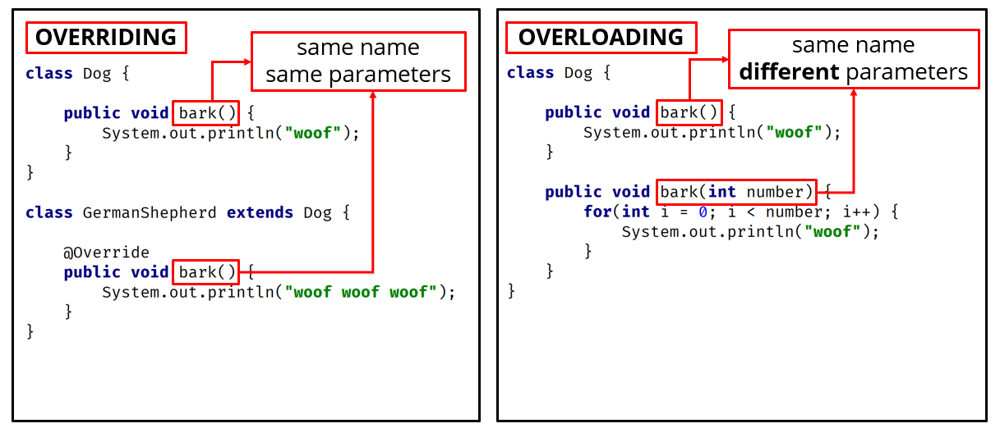
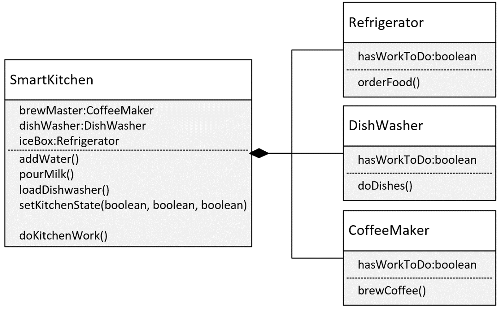

# Table of Contents

1. [Method Overloading and Overriding](#Method-Overloading-And-Overriding)

   - [Method Overloading](<#Method-Overloading-(Compile-time-polymorphism)>)
   - [Method Overriding](<#Method-Overriding-(Runtime-Polymorphism)>)
   - [Method Overloading vs Overriding](#Method-Overriding-vs-Method-Overloading)

2. [Composition](#Composition)

3. [Encapsulation](#Encapsulation)

4. [Polymorphism](#Polymorphism)

## Method Overloading and Overriding

### Method Overloading (Compile time Polymorphism)

`Method overloading` means providing two or more separate methods, in a class, with the `same name`, but `different parameters`.

Method return type may or may not be different, and that allows us to reuse the same method name.

`Overloading` is very handy, it `reduces duplicated code`, and we don't have to remember multiple method names.

We can overload static, or instance methods.

To the code calling an overloaded method, it looks like a single method can be called, with different sets of arguments.

In actuality, each call that's made with a different set of arguments, is calling a separate method.

Java developers often refer to method overloading, as compile-time polymorphism.

This means the compiler is determining the right method to call, based on the method name and argument list.

Usually `overloading` happens within a `single class`.

But methods can also be overloaded by subclasses.

That's because, a subclass inherits one version of the method from the parent class, and then the subclass can have another overloaded version of that method.

**Method Overloading Rules**

Methods will be considered overloaded if both methods follow the following rules:

- Methods must have the same method name.
- Methods must have different parameters.

If methods follow the rules above:

- They may or may not have different return types.
- They may or may not have different access modifiers.
- They may or may not throw different checked or unchecked exceptions.

### Method Overriding (Runtime Polymorphism)

Method overriding, means defining a method in a child class, that already exists in the parent class, with the same signature (the `same name, same arguments`).

By extending the parent class, the child class gets all the methods defined in the parent class (those methods are also known as derived methods).

`Method overriding` is also known as `Runtime Polymorphism`, or `Dynamic Method Dispatch`, because the method that is going to be called, is decided at runtime, by the Java virtual machine.

When we `override` a method, it's recommended to put `@Override`, immediately above the method definition.

The @Override statement is not required, but it's a way to get the compiler to flag an error, if you don't actually properly override this method.

We'll get an error, if we don't follow the overriding rules correctly.
We can't override static methods, `only instance methods` can be overridden.

**Method Overriding Rules**

A method will be considered overridden, if we follow these rules.

- It must have the same name and same arguments.
- The return type can be a subclass of the return type in the parent class.
- It can't have a lower access modifier. In other words, it can't have more restrictive access privileges.
- For example, if the parent's method is protected, then using private in the child's overridden method is not allowed. However, using public for the child's method would be allowed, in this example.

There's also some important points about method overriding to keep in mind.

- Only `inherited methods` can be overridden, in other words, methods can be overridden only in child classes.
- Constructors and private methods cannot be overridden.
  Methods that are final cannot be overridden.
- A subclass can use super.methodName() to call the superclass version of an overridden method.

### Method Overriding vs Method Overloading

<p align="center">

</p>

| Method Overloading                                                       | Method Overriding                                                                |
| ------------------------------------------------------------------------ | -------------------------------------------------------------------------------- |
| Provides functionality to reuse a method name with different parameters. | Used to override a behavior which the class has inherited from the parent class. |
| Usually in a single class but may also be used in a child class.         | `Always in two classes` that have a child-parent or IS-A relationship.           |
| `Must have` different parameters                                         | `Must have` the same parameters and same name.                                   |
| May have different return types.                                         | `Must have` the same return type or covariant return type(child class).          |
| May have different access modifiers(private, protected, public).         | `Must NOT` have a lower modifier but may have a higher modifier                  |
| May throw different exceptions.                                          | `Must NOT` throw a new or broader checked exception.                             |

## Composition

<p align="center">

</p>

`Composition` is another component of object-oriented programming. `Composition` is a way to make the combination of classes, act like a single coherent object.

**The reasons composition is preferred over inheritance:**

- Composition is more flexible. You can add parts in, or remove them, and these changes are less likely to have a downstream effect.
- Composition provides functional reuse outside of the class hierarchy, meaning classes can share attributes & behavior, by having similar components, instead of inheriting functionality from a parent or base class.
- Java's inheritance breaks encapsulation, because subclasses may need direct access to a parent's state or behavior.

**Why is Inheritance less flexible?**

- Inheritance is less flexible.
- Adding a class to, or removing a class from, a class hierarchy, may impact all subclasses from that point.
- In addition, a new subclass may not need all the functionality or attributes of its parent class.

<details>
<summary><strong> Example for composition </strong></summary>

```java

public class SmartKitchen {

    private CoffeeMaker brewMaster;
    private Refrigerator iceBox;
    private DishWasher dishWasher;

    public SmartKitchen() {
        brewMaster = new CoffeeMaker();
        iceBox = new Refrigerator();
        dishWasher = new DishWasher();
    }

    public CoffeeMaker getBrewMaster() {
        return brewMaster;
    }

    public Refrigerator getIceBox() {
        return iceBox;
    }

    public DishWasher getDishWasher() {
        return dishWasher;
    }

    public void setKitchenState(boolean coffeeFlag, boolean fridgeFlag,
                                boolean dishWasherFlag) {

        brewMaster.setHasWorkToDo(coffeeFlag);
        iceBox.setHasWorkToDo(fridgeFlag);
        dishWasher.setHasWorkToDo(dishWasherFlag);
    }

    public void doKitchenWork() {
        brewMaster.brewCoffee();
        iceBox.orderFood();
        dishWasher.doDishes();
    }
}

class CoffeeMaker {

    private boolean hasWorkToDo;

    public void setHasWorkToDo(boolean hasWorkToDo) {
        this.hasWorkToDo = hasWorkToDo;
    }

    public void brewCoffee() {

        if (hasWorkToDo) {
            System.out.println("Brewing Coffee");
            hasWorkToDo = false;
        }
    }
}


class Refrigerator {

    private boolean hasWorkToDo;

    public void setHasWorkToDo(boolean hasWorkToDo) {
        this.hasWorkToDo = hasWorkToDo;
    }

    public void orderFood() {

        if (hasWorkToDo) {
            System.out.println("Ordering Food");
            hasWorkToDo = false;
        }
    }
}

class DishWasher {

    private boolean hasWorkToDo;

    public void setHasWorkToDo(boolean hasWorkToDo) {
        this.hasWorkToDo = hasWorkToDo;
    }

    public void doDishes() {

        if (hasWorkToDo) {
            System.out.println("Washing Dishes");
            hasWorkToDo = false;
        }
    }
}
```

</details>

## Encapsulation

**Why would we want to hide things in Java?**

- To make the interface simpler, we may want to hide unnecessary details.

- To protect the integrity of data on an object, we may hide or restrict access to some of the data and operations.

- To decouple the published interface from the internal details of the class, we may hide actual names and types of class members.

**What do we mean by interface here?**

- Although Java has a type called interface, that's not what we're talking about here.

- When we talk about a class's public or published interface, we're really talking about the class members that are exposed to, or can be accessed by, the calling code.

- Everything else in the class is internal, or private to it.
  An application programming interface, or API, is the public contract, that tells others how to use the class.

**Problems**

- Allowing direct access to data on an object, can potentially bypass checks, and additional processing, your class has in place to manage the data.
- Allowing direct access to fields, means calling code would need to change, when you edit any of the fields.
- Omitting a constructor, that would accept initialization data, may mean the calling code is responsible for setting up this data, on the new object.

**The problems when classes aren't properly encapsulated**

- Allowing direct access to data on an object, can bypass checks and operations.
- It encourages an interdependency, or coupling, between the calling code and the class.
- For the previous example, we showed that changing a field name, broke the calling code.
- And we also showed, that the calling code had to take on the responsibility, for properly initializing a new Player.

**Benefits of Encapsulation**

- That's really one of the huge benefits of encapsulation, is that you're not actually affecting any other code.
- It's sort of like a black box in many ways. But the EnhancedPlayer class has more control over it's data.

**Encapsulation Principles**

_To create an encapsulated class, you want to:_

- Create constructors for object initialization, which enforces that only objects with valid data will get created.
- Use the private access modifier for your fields.
- Use setter and getter methods sparingly, and only as needed.
- Use access modifiers that aren't private, only for the methods that the calling code needs to use.

<details>
<summary><strong> Example for encapsulated </strong></summary>

```java

public class Printer {

    private int tonerLevel;
    private int pagesPrinted;
    private boolean duplex;

    public Printer(int tonerLevel, boolean duplex) {
        this.pagesPrinted = 0;
        this.tonerLevel = (tonerLevel >= 0 && tonerLevel <= 100) ? tonerLevel : -1;
        this.duplex = duplex;
    }

    public int addToner(int tonerAmount) {

        int tempAmount = tonerAmount + tonerLevel;
        if (tempAmount > 100 || tempAmount < 0) {
            return -1;
        }
        tonerLevel += tonerAmount;
        return tonerLevel;
    }

    public int printPages(int pages) {

        int jobPages = (duplex) ? (pages / 2) + (pages % 2) : pages;
        pagesPrinted += jobPages;
        return jobPages;
    }

    public int getPagesPrinted() {
        return pagesPrinted;
    }
}

```

</details>
<br>

## Polymorphism

- Polymorphism lets us write code to call a method, but at runtime, this method's behavior can be different, for different objects.
- This means the behavior that occurs, while the program is executing, depends on the runtime type of the object.
- And the runtime type, might be different from the declared type in the code.
- The declared type has to have some kind of relationship to the runtime type, and inheritance is one way to establish this relationship.
- There are other ways, but in this here, we'll talk about how to use inheritance, to support polymorphism.

**Polymorphism in action**

That was polymorphism in action.

- It's the ability to execute different behavior, for different types, which are determined at runtime. And yet we did it with just two statements, in the main method, as shown here.

```java
    Movie movie = Movie.getMovie(type,title);
    movie.watchMovie();
```

- Polymorphism enables you to write generic code, based on the base class, or a parent class. And this code, in the main method, is extendable, meaning it doesn't have to change, as new subclasses become available.
- This code can handle any instances that are a Movie, or a subclass of movie, that are returned from the factory method.

<details>
<summary><strong> Example for Polymorphism  </strong></summary>

```java
public class Car {

    private String description;

    public Car(String description) {
        this.description = description;
    }

    public void startEngine() {
        System.out.println("Car -> startEngine");
    }

    protected void runEngine() {
        System.out.println("Car -> runEngine");
    }

    public void drive() {
        System.out.println("Car -> driving, type is " + getClass().getSimpleName());
        runEngine();
    }
}

class GasPoweredCar extends Car {

    private double avgKmPerLiter;
    private int cylinders = 6;

    public GasPoweredCar(String description) {
        super(description);
    }

    public GasPoweredCar(String description, double avgKmPerLiter, int cylinders) {
        super(description);
        this.avgKmPerLiter = avgKmPerLiter;
        this.cylinders = cylinders;
    }

    @Override
    public void startEngine() {
        System.out.printf("Gas -> All %d cylinders are fired up, Ready!%n", cylinders);
    }

    @Override
    protected void runEngine() {
        System.out.printf("Gas -> usage exceeds the average: %.2f %n", avgKmPerLiter);
    }
}

```

</details>
<br>
